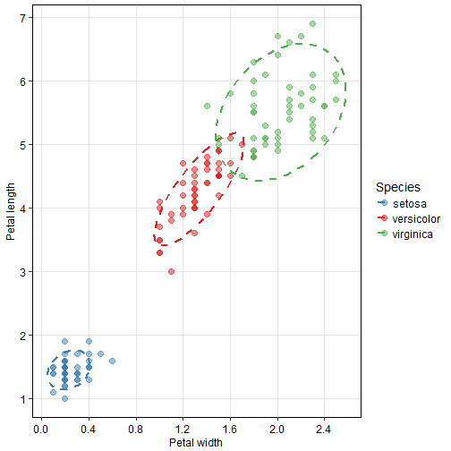

Pitch Presentation
========================================================
author: Miriam Ben-Hamo 
date: January - 30 - 2018
autosize: true

Excutive Summary
========================================================

This presentation is meant to accompany the final project for the Coursera course, titled: "Data Products".

I chose to use the 'iris' dataset provided by R and build a Random Forest model that will predict the species
of the iris flower based on the length and the width of the petal. 

There are three possible Iris species:

- Setosa ('Blue')
- Versicolor ('Red')
- Virginica ('Green')

I generated a Shiny application in which the user can input the length and the width of the petal, and in return
my random forest model will predict the species of this specific flower.

About the application
========================================================
In my application the user can use a slider to input:

- Petal length

- Petal width

The user can then click a rubric to choose whether the values chosen above should be plotted or not.

In the next slide you will see the plot generated by default by my Shiny application.

Predicting Iris Species
========================================================

Final Notes
========================================================
If the user chooses to show the values chosen by the slider bars, then they will be plotted on top of the plot from the previous slide.

The color of the added point will depend on the predicted species of the flower according to the random forest model.

In addition, there will also be a line of text indicating the prediction by the model, regardless of whether the values are added to the plot or not.

THE END
